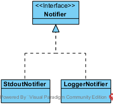

# Architecture

## Introduction

GIT as well as other well-known version control systems cannot version directories. In other words, you cannot add empty directories! A "workaround" for this issue is to use marker files which are placed into empty directories. These marker files can then be committed into the repository and will make sure that, upon checkout, the directory tree is entirely reconstructed. This solution is also suggested in the GitFaq. Note however, that using that workaround might not be a good idea. Creating missing directories during a build process should also be considered as an option.

Sometimes a solution where the missing directories are created by some magic is not practicable and people will face the problem of managing such marker files. In particular, the problem with using marker files is that you need to create them, and delete them, if they are not necessary anymore (because there were added sub-directories or files). With big source trees managing these marker files can be cumbersome and error prone.

In the past, I had been confronted with such a situation several times. This is why I decided to write an open source tool which can manage the creation/deletion of such marker files automatically. It creates marker files in all empty directories. If later new files or directories are put into such directories, the marker files are not necessary anymore and, thus, are removed automatically.

## Use Cases


In the following sections some typical use cases are described and it is shown how `markemptydirs` can help you getting your work easily done. For clarity, I use directory names with upper case letters and file names with lowercase letters in the following examples.

### Mark empty directories with a marker file

Within a directory `PROJECT` find all "leaf" directories that do not contain any files or sub-directories, and create a marker file `.emptydir` within each such "leaf" directory.

For example, let's assume the following source tree:

```text
[PROJECT]
        |
        *--[DIR1]
        |       |
        |       *--[DIR1-1]
        |
        *--[DIR2]
        |       |
        |       *--file1
        |
        *--[DIR3]
```

A tree with the corresponding marker files will then look like this:

```text
[PROJECT]
        |
        *--[DIR1]
        |       |
        |       *--[DIR1-1]
        |                 |
        |                 *--.emptydir
        |
        *--[DIR2]
        |       |
        |       *--file1
        |
        *--[DIR3]
                |
                *--.emptydir
```

To create the `.emptydir` files use the `markemptydirs` tool simply like this:

```sh
markemptydir update PROJECT
```

### Update marker files

Let's assume the `PROJECT` directory has undergone some changes. Directories and/or files have been added and/or deleted. This requires to synchronize the corresponding marker files. In particular, some now are not needed anymore and new ones may now be necessary.

For instance, have a look at the following tree:

```text
[PROJECT]
        |
        *--[DIR1]
        |       |
        |       *--[DIR1-1]
        |                 |
        |                 *--.emptydir
        |                 |
        |                 *--newfile.txt
        |
        *--[DIR2]
        |
        *--[DIR3]
                |
                *--.emptydir
```

`DIR1-1` now contains a new file `newfile.txt` and a previously created `.emptydir` file. The former now acts as a placholder and, thus, the latter is not needed anymore. `DIR2` now is empty and requires a marker file.

Consequently, after updating the marker files the tree should look like this:

```text
[PROJECT]
        |
        *--[DIR1]
        |       |
        |       *--[DIR1-1]
        |                 |
        |                 *--newfile.txt
        |
        *--[DIR2]
        |       |
        |       *--.emptydir
        |
        *--[DIR3]
                |
                *--.emptydir
```

Using the `markemptydirs` tool for synchronization one would simply do (again):

```sh
markemptydirs update PROJECT
```

### List all marker files

== List marker files ==

In order to list all marker files just execute:

```sh
markemptydirs list PROJECT
```

### Remove all marker files

There are situations where one wants a clean tree which does not contain any marker files. So all `.emptydir` files should be removed.

This can simply be achieved by using the `clean` command:

```sh
markemptydirs clean PROJECT
```

### Purge files contained in directories with marker files

Sometime you may want to keep directories marked with marker files empty. Use the `purge` command to delete all files and subdirectories contained within directories having a marker file:

```sh
markemptydirs purge PROJECT
```

## Implementation in Rust


As the picture above shows the project is structured into modules and submodules.

### Module `api`

This module contains all the program logic required for implementing all the described [use cases](#use-cases).

Functionalities in this module are again grouped into submodules.

#### Submodule `application`


An application like the CLI based tool `markemptydirs` or some GUI application will use this module in order to create a `Session` which is composed of the `Command`object to execute es well as a `Context` which be passed to the command when it is executed. It contains all application and configuration information details as well as command and query functions a command might need for its task.

#### Submodule `fs`


This module contains all file system related functionalities required by commands.

In particular, it contains two `FileSystemAccess` implementations. `RealFileSystemAccess` with interface method implementations that actually have side effects on the file system, and `DryRunFileSystemAccess` which makes sure no interface method call has a side effect. As the name suggests it is used for simulating command executions. The idea is that commands do not know and do not have to care about which one of those implementations they are using. So they can concentrate on their task and do not have to distinguish between a "dry run" and a normal one making code simpler and less prone to errors.

Another key class in this module is the `FileSystemCrawler` which implements the logic for recursively crawling files system directories. It uses [Rayon][rayon] which utilizes a work-stealing algorithm  allowing to crawl a file system in a highly parallel manor. This speeds up the crawling precess a lot when you are running it an SSD. Mozilla also uses this library in their [Firefox Quantum][firefox-quantum] project for their parallel CSS engine [Stylo][firefox-stylo]. In fact, this library was the reason why I started this Rust project in the first place.

#### Submodule `notification`



This module is rather small. It contains a `Notifier` interface as well as two implementations -- a `StdoutNotifier` and a `LoggerNotifier` intended for debugging purpose only. The interface defines methods a command can use to notify interested parties about useful runtime information or errors. It supports different log levels and allows to chose between short or long output messages. While the `StdoutNotifier` implementation can directly be used for a CLI based tool, a GUI based tool would likely need to provide its own interface implementation.

#### Submodule `commands`


This module defines a common interface `Command` which is implemented by all command implementations. It defines a single `execute` method function which accepts a `Context` as its only parameter and returns a `Result` enumeration object. The two possible values either indicate a successful execution with `Ok` or a failed on with `Err`.

In order to facilitaty unit testing `Context` is just an interface (a trait). There is a `DefaultContext` implementation which is used for production and a `TestContext` implementation for unit tests.

The `Context` passed to the `Command` when its `execute` method function is called on the one hand provides read access to application and version information, and on the other hand it provides access to a `Notifier` and has methods for accessing the file system.

## About the parallel directory crawling algorithm

[Rayon][rayon] provides a way to process over a list in parallel using a parralel iterator implementation. So a crawling mechanism matching this list processing prcessing behavior was needed.

I finally decided to implement an algorithm which crawls a directory tree based on a breath-first traversal. The algorithm is started with an initial list of directory paths to crawl. For each of these directory paths a list of paths to their direct child files and directories is then obtained in parallel. Once finished, all the path lists are collected and merged into a single one and the algorithm starts over with the new bigger list of paths. And so on. [Rayon][rayon]'s work-stealing mechanism will make sure this parallel processing is always done with as much CPU cores as are available.


[rayon]: https://docs.rs/rayon
[firefox-quantum]: https://blog.rust-lang.org/2017/11/14/Fearless-Concurrency-In-Firefox-Quantum.html
[firefox-stylo]: https://wiki.mozilla.org/Quantum/Stylo